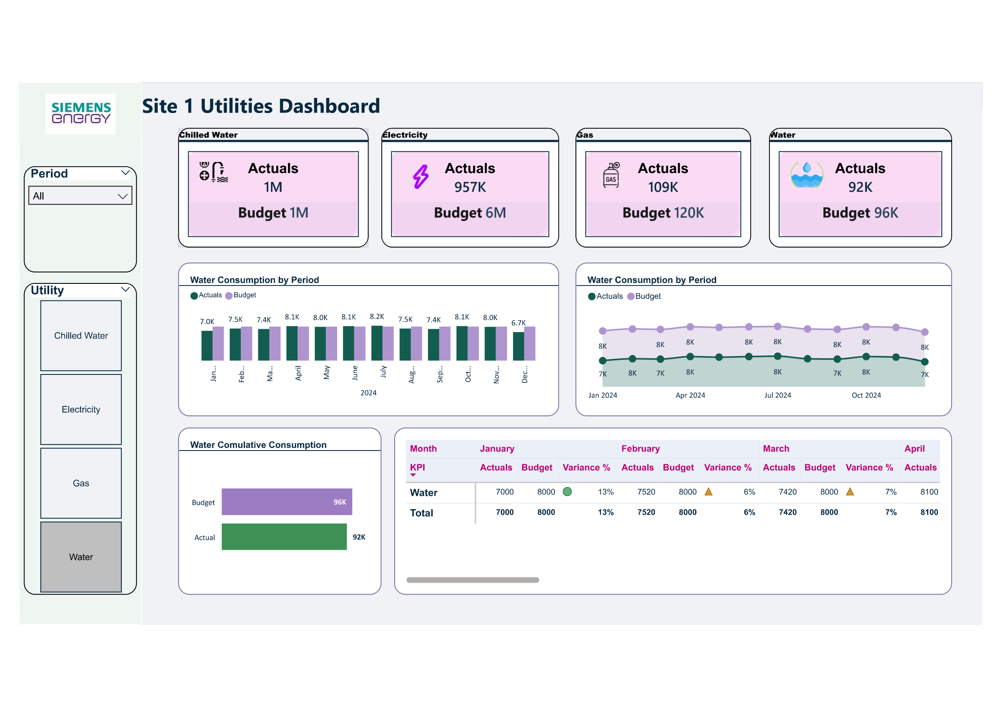

# 📊 Sales Performance Dashboard 

## Overview
📌 This dashboard provides insights into sales performance, targets vs actuals, and regional trends.

## Preview

## File
You can download the Power BI `.pbix` file from this repository.

## Tools Used
- Power BI
- DAX
- Data Modeling
##

# ⚡ Utilities Dashboard

## Overview
This Power BI dashboard provides insights into utility consumption across different categories including electricity, gas, water, and chilled water. It compares actual usage with budget values to highlight performance and efficiency.

## Key Features
- Monthly consumption analysis  
- Actual vs Budget comparison  
- Variance (%) tracking  
- Utility-wise breakdown (Electricity, Gas, Water, Chilled Water)  
- Regional and period-based filtering  

## 📸 Preview

## Insights
- Identifies areas where utility consumption exceeds budget  
- Helps monitor efficiency across utilities  
- Supports decision-making for cost optimization  

## Tools Used
- Power BI  
- DAX  
- Data Modeling  
