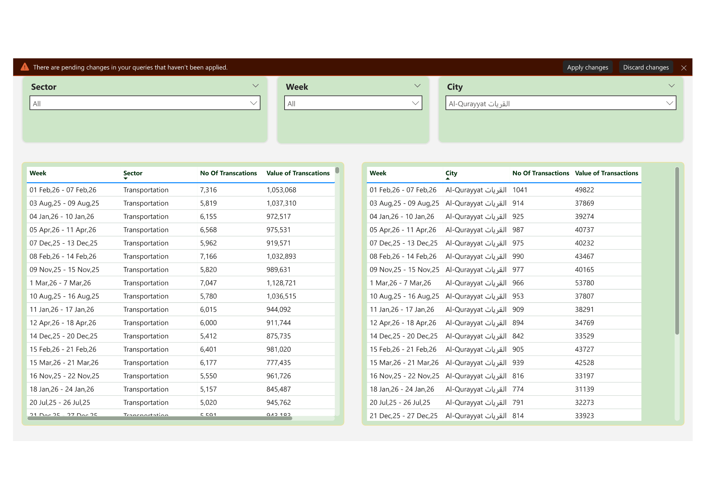

# 📊 Power BI Dashboard Portfolio

This repository showcases my Power BI dashboards created during my learning journey.

---

# 📄 PDF Data Automation & Power BI Query Stabilization (Freelance Project)

## Overview
This is a real-world freelance Power BI project where I fixed a recurring query failure issue caused by changing PDF report formats.

## Problem
The client was downloading weekly PDF reports from a website and placing them into OneDrive folders for Power BI reporting.

The issue was that the PDF structure kept changing after some time, which caused the Power Query transformation steps to break.  
The client also could not clearly identify the root cause of the query failures.

## Root Cause Analysis
I first investigated the complete Power Query process step by step and identified where the queries were breaking and why.

The main issue was that Power BI was trying to process PDF files with different structures using the same transformation logic.  
Since the files did not follow one consistent structure, the query became unstable.

## Solution
Instead of forcing all PDF formats into one query, I redesigned the process.

I created separate Power Query transformations for each group of PDF files with the same structure.  
Each format type was handled separately, and then the cleaned outputs were appended into one final consolidated dataset.

## Impact
- Fixed recurring query break issues  
- Identified the exact root cause of failures  
- Made the reporting process more stable  
- Reduced manual troubleshooting  
- Created a cleaner and more maintainable Power BI solution  

## Technical Highlights
- Root cause analysis of broken Power Query steps  
- PDF data extraction using Power BI  
- Separate queries for different PDF structures  
- Folder-based data handling  
- Append queries into one final dataset  
- Power Query transformation and cleanup  

## 📸 Preview

---

# 🎓 AdventureWorks Dashboard (Certification Project)

## Overview
This dashboard was developed during my Power BI certification (Udemy – 15 hours course). It demonstrates advanced Power BI concepts and real-world dashboard design techniques.

## Skills Applied
- Bookmarks & navigation  
- Drill-through  
- Advanced slicers  
- Multi-card visuals  
- Image-based slicers  
- DAX & data modeling  
- Advanced dashboard design  

## 📸 Preview

---

# ⚡ Electric Metering Health Monitoring System

## Overview
This dashboard provides a comprehensive view of electrical system performance, including energy consumption, voltage stability, current load, and power factor efficiency.

## Note
This dashboard layout is inspired by Qatar General Electricity & Water Corporation.  
The dataset used in this project was generated using AI tools.

## 📸 Preview

---

# 📈 Sales Dashboard

## Overview
This dashboard provides insights into sales performance, including revenue trends, targets vs actuals, and regional analysis.

## 📸 Preview

---

# ⚡ Utilities Dashboard

## Overview
This dashboard provides insights into utility consumption including electricity, gas, water, and chilled water with budget comparison.

## 📸 Preview

---

## 🛠 Tools Used
- Power BI  
- DAX  
- Data Modeling  
