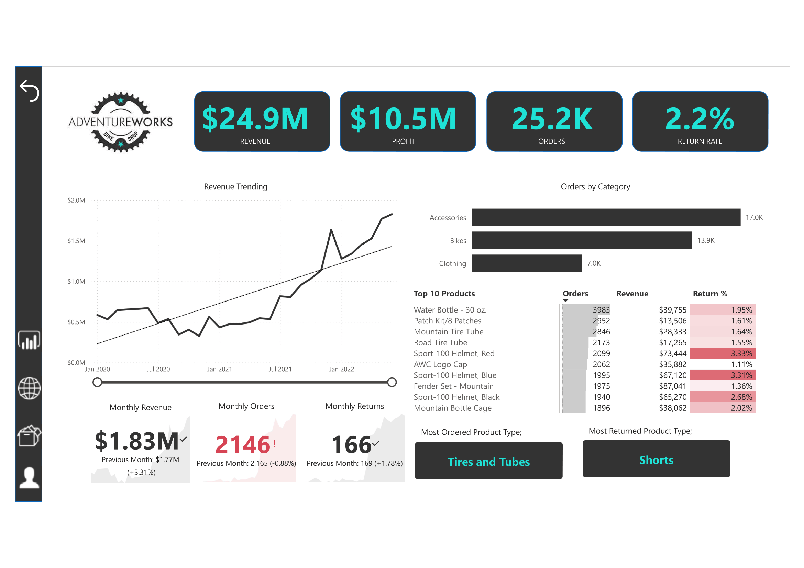
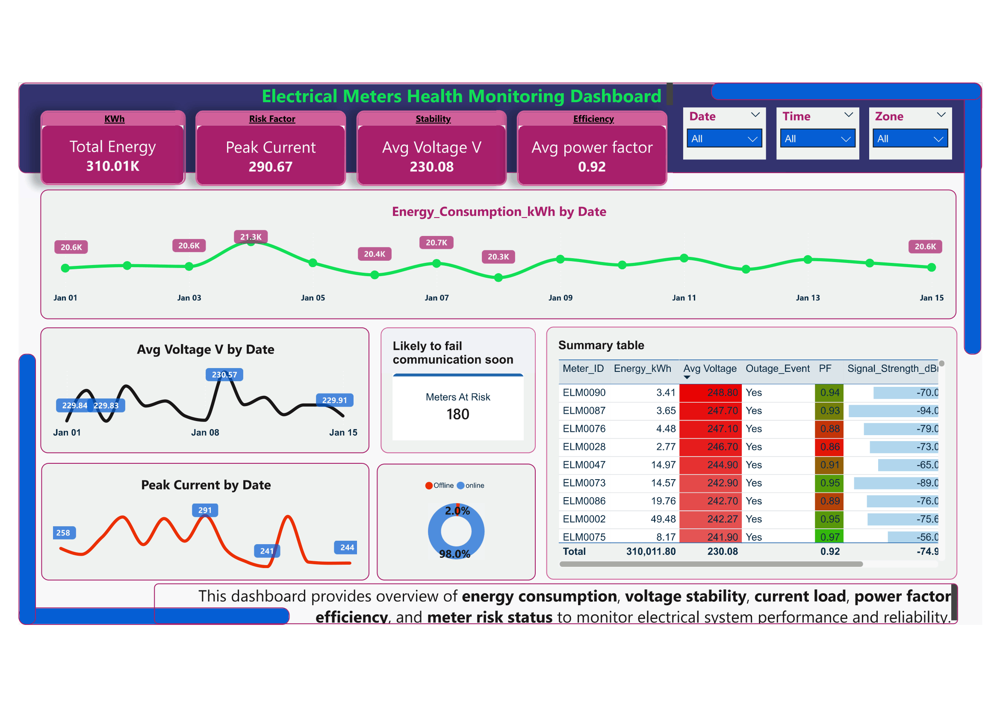
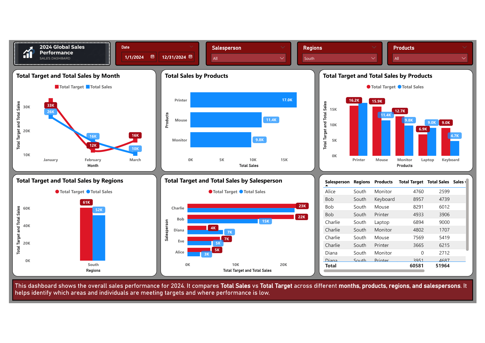

# 📊 Power BI Dashboard Portfolio

This repository showcases my Power BI dashboards created during my learning journey.

---

# 🎓 AdventureWorks Dashboard (Certification Project)

## Overview
This dashboard was developed during my Power BI certification (Udemy – 15 hours course). It demonstrates advanced Power BI concepts and real-world dashboard design techniques.

## Skills Applied
- Bookmarks & navigation  
- Drill-through  
- Advanced slicers  
- Multi-card visuals  
- Image-based slicers  
- DAX & data modeling  
- Advanced dashboard design  

## 📸 Preview

---

# ⚡ Electric Metering Health Monitoring System

## Overview
This dashboard provides a comprehensive view of electrical system performance, including energy consumption, voltage stability, current load, and power factor efficiency.

## Note
This dashboard layout is inspired by HARMA Qatar.  
The dataset used in this project was generated using AI tools.

## 📸 Preview

---

# 📈 Sales Dashboard

## Overview
This dashboard provides insights into sales performance, including revenue trends, targets vs actuals, and regional analysis.

## 📸 Preview

---

# ⚡ Utilities Dashboard

## Overview
This dashboard provides insights into utility consumption including electricity, gas, water, and chilled water with budget comparison.

## 📸 Preview

---

## 🛠 Tools Used
- Power BI  
- DAX  
- Data Modeling  
