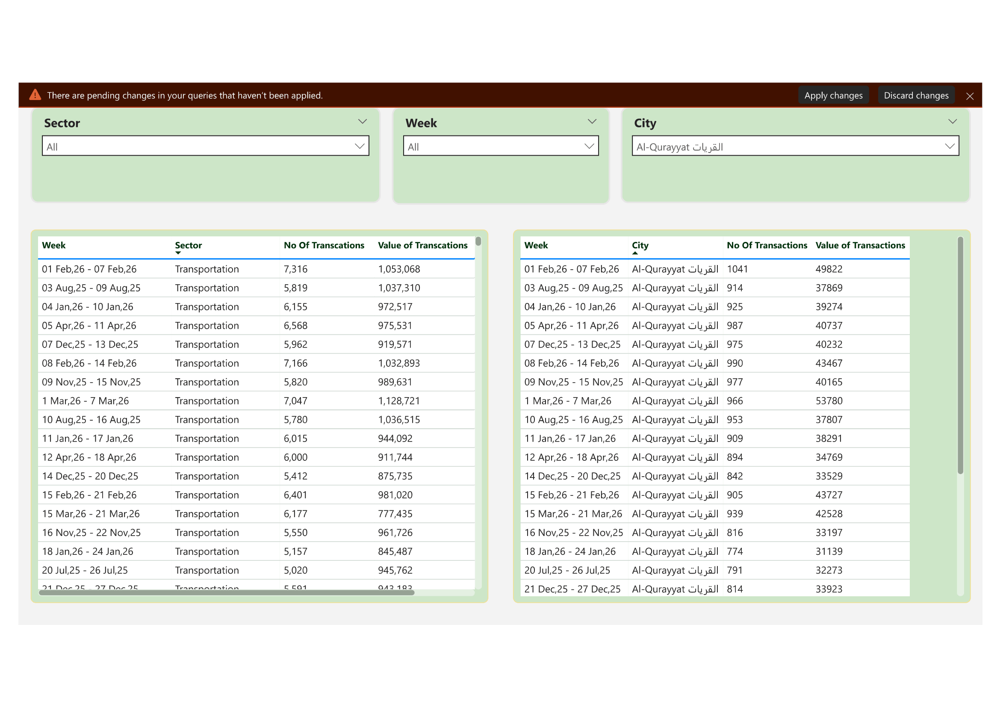
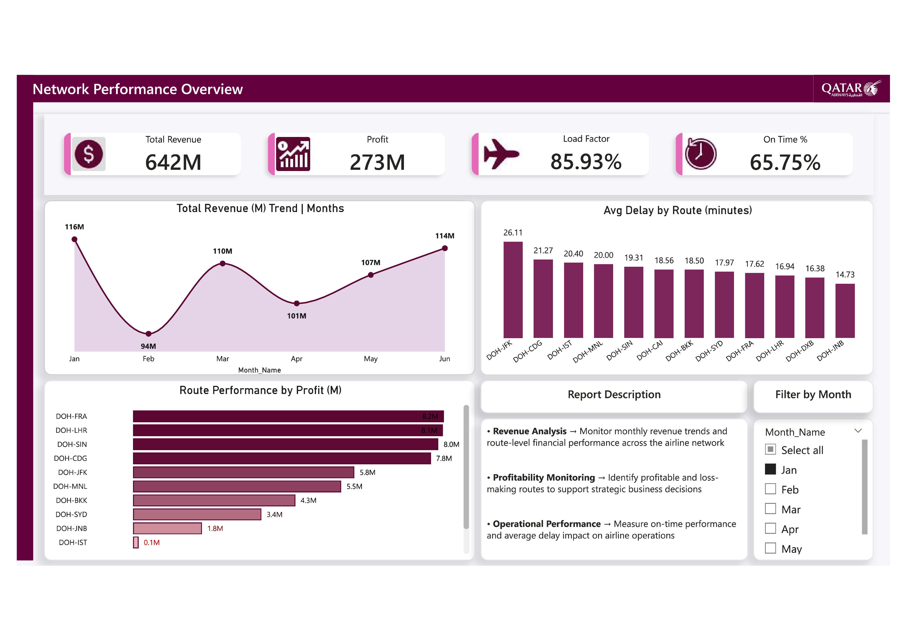
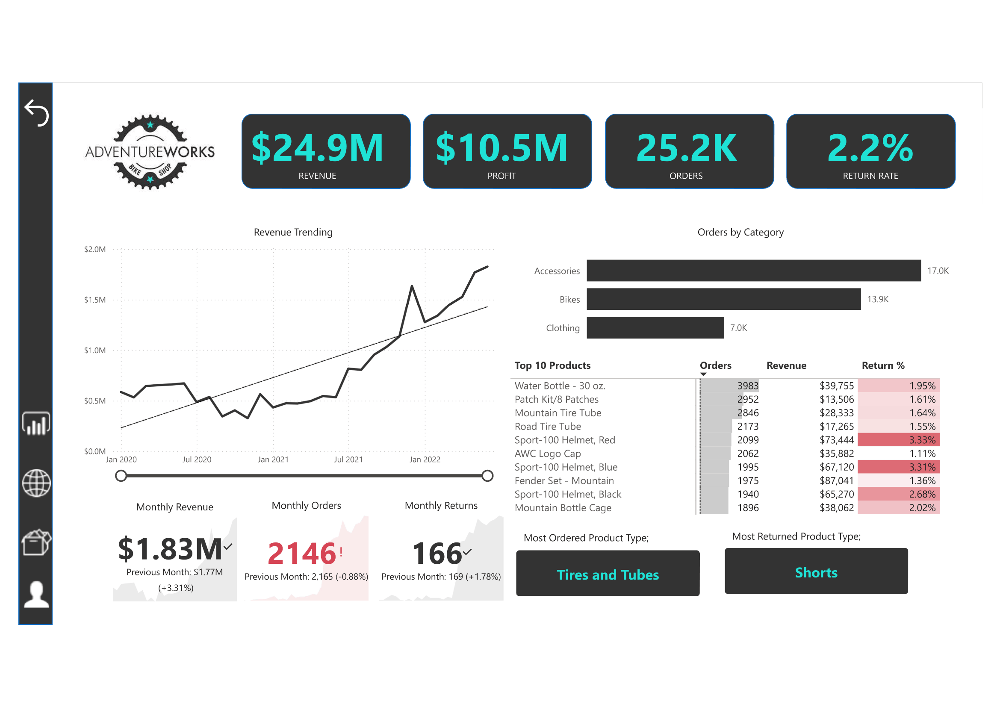
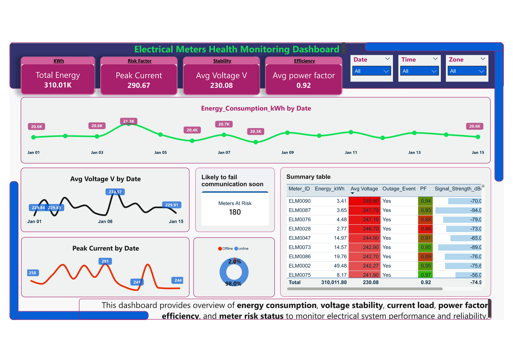
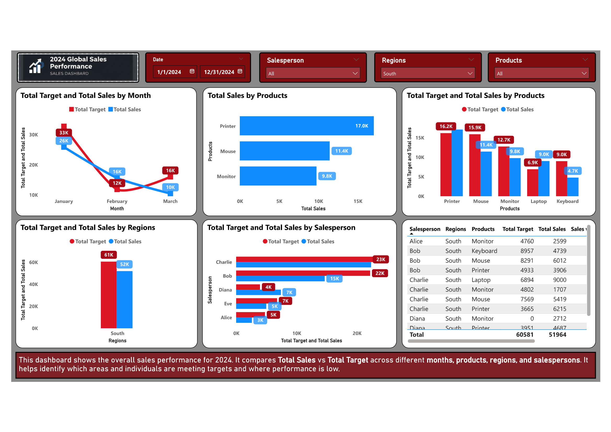
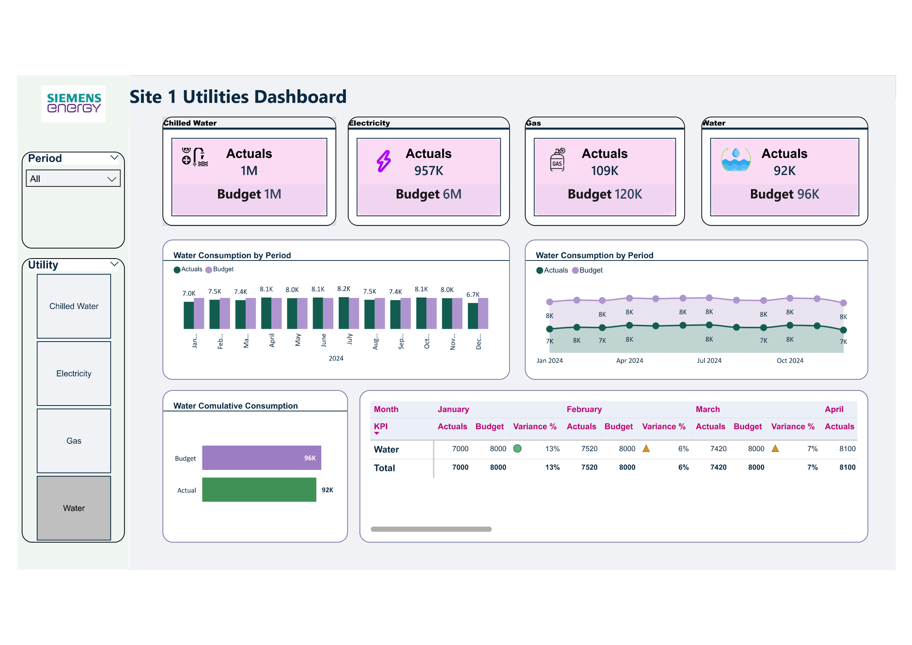

# 📊 Power BI Dashboard Portfolio

This repository showcases my Power BI dashboards, business intelligence projects, and real-world reporting solutions developed during my learning journey and freelance work.

---

# 📄 PDF Data Automation & Power BI Query Stabilization (Freelance Project)

## 📌 Overview
This is a real-world freelance Power BI project where I resolved recurring query failures caused by changing PDF report structures.

## ❗ Business Problem
The client downloaded weekly PDF reports from a website and stored them in OneDrive folders for automated Power BI reporting.

Over time, the PDF layouts changed, causing Power Query transformation steps to fail and making the reporting process unstable.

The client also struggled to identify the exact root cause of these failures.

## 🔍 Root Cause Analysis
I investigated the entire Power Query workflow step by step and identified where the transformation logic was breaking.

The main issue was that Power BI was processing PDF files with different structures using the same transformation logic.

## ✅ Solution
Instead of forcing all formats into one query, I redesigned the solution by:

- Creating separate Power Query transformations for each PDF structure
- Cleaning and standardizing outputs independently
- Appending all cleaned datasets into one final consolidated table

## 🚀 Impact
- Fixed recurring query break issues
- Improved reporting stability
- Reduced manual troubleshooting
- Created a scalable and maintainable solution
- Identified the exact root cause of failures

## 🛠 Technical Highlights
- Power Query transformation & cleanup
- PDF data extraction using Power BI
- Root cause analysis
- Folder-based automation
- Append queries & data consolidation

## 📸 Preview

## 📂 Files Included
- [Download PBIX](PDF-Automation/POS_Dashboard.pbix)

---

# ✈️ Airline Network Planning & Route Optimization Dashboard

## 📌 Overview
This dashboard analyzes airline operational performance, revenue trends, route profitability, delays, and load factor optimization.

## ❗ Business Problem
Airline management needed better visibility into:
- Route profitability
- Revenue trends
- Delay performance
- Load factor efficiency
- On-time operational KPIs

## ✅ Solution
Developed an interactive Power BI dashboard providing:
- Revenue & profit analysis
- Delay monitoring by routes
- Route performance tracking
- KPI monitoring
- Dynamic filtering & trend analysis

## 📊 Key KPIs
- Total Revenue
- Profit
- Load Factor
- On-Time %
- Delay by Route

## 🛠 Tools Used
- Power BI
- DAX
- Power Query
- Data Modeling

## 📸 Preview

## 📂 Files Included
- [Download PBIX](Airline-Network/Airline_Network_Planning_%26_Route_Optimization_Report.pbix)
- [Business Use Case PDF](Airline-Network/Airline_Network_Planning_Use_Case.pdf)

---

# 🎓 AdventureWorks Dashboard (Certification Project)

## 📌 Overview
This dashboard was developed during my Power BI certification course (Udemy – 17 Hours). It demonstrates advanced dashboard design and analytical reporting techniques.

## 🛠 Skills Applied
- Bookmarks & navigation
- Drill-through pages
- Advanced slicers
- Multi-card visuals
- DAX calculations
- Data modeling
- Dashboard storytelling

## 📸 Preview

## 📂 Files Included
- [Download PBIX](AdventureWorks/AdventureWorks Dashboard.pbix)

---

# ⚡ Electric Metering Health Monitoring System

## 📌 Overview
This dashboard provides a comprehensive overview of electrical system performance including:
- Energy consumption
- Voltage stability
- Current load
- Power factor efficiency

## 📝 Note
The dashboard design is inspired by Qatar General Electricity & Water Corporation.

The dataset used in this project was generated using AI tools.

## 📸 Preview

## 📂 Files Included
- [Download PBIX](Electric-Metering/Electricity Meters Monitoring Dashboard.pbix)

---

# 📈 Sales Dashboard

## 📌 Overview
This dashboard provides insights into:
- Revenue trends
- Target vs actual performance
- Regional sales analysis
- KPI monitoring

## 📸 Preview

## 📂 Files Included
- [Download PBIX](Sales/Sales Dashboard.pbix)

---

# ⚡ Utilities Dashboard

## 📌 Overview
This dashboard provides insights into utility consumption including:
- Electricity
- Water
- Gas
- Chilled water
- Budget comparison

## 📸 Preview

## 📂 Files Included
- [Download PBIX](Utilities/Utilities Dashboard.pbix)

---

# 🛠 Tools & Technologies Used

- Power BI
- DAX
- Power Query
- Data Modeling
- Excel
- SQL
- Data Visualization
- Dashboard Design
